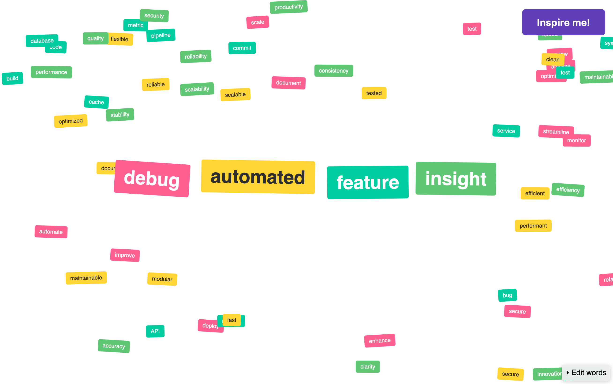

# Brainfog

Break through creative blocks by combining random words. Drag colorful labels across your screen. Click "Inspire me!" to generate new combinations. Watch unexpected connections spark fresh ideas.

**[Try it live →](https://gabssnake.github.io/brainfog/)**

## Perfect for

- Product ideation and feature concepts
- Team brainstorming warm-ups
- Breaking routine thinking patterns
- Technical problem solving
- Creative writing

## How it works

Brainfog displays words from four categories (verbs, nouns, adjectives, outcomes) as draggable labels. Click "Inspire me!" to shuffle words and generate a random combination. It highlights the generated idea in the center.

## Quick start

1. Click "Inspire me!" to generate your first idea
2. Drag words to explore connections
3. Customize word lists in the bottom right corner. They persist in your browser
4. Keep clicking to generate fresh combinations

## Why use it

Research supports this approach.

- Random word association increases creative output by forcing novel connections[^1].
- Visual and spatial thinking activates different neural pathways than linear text processing, leading to more diverse idea generation[^2].
- Breaking cognitive patterns through forced combinations helps overcome functional fixedness, the tendency to see objects only in their usual way[^3].

[^1]: Mednick, S. (1962). The associative basis of the creative process. Psychological review, 69(3), 220. https://doi.org/10.1037/h0048850 [[pdf]](https://pdfs.semanticscholar.org/927c/10385d93d538e2791f8ef28c5eaf96e08a73.pdf)

[^2]: Finke, R. A., Ward, T. B., & Smith, S. M. (1996). Creative cognition: Theory, research, and applications. MIT press. ISBN: 9780262560962. [[pdf summary]](https://www.dcs.warwick.ac.uk/oldmodelling/low/theses/paulness/appendixd.pdf)

[^3]: Duncker, K. (1945). On problem-solving. Psychological Monographs, 58(5), i-113. https://doi.org/10.1037/h0093599 [[pdf]](https://ia600108.us.archive.org/view_archive.php?archive=/24/items/wikipedia-scholarly-sources-corpus/10.1037%252Fh0034974.zip&file=10.1037%252Fh0093599.pdf)
